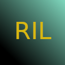
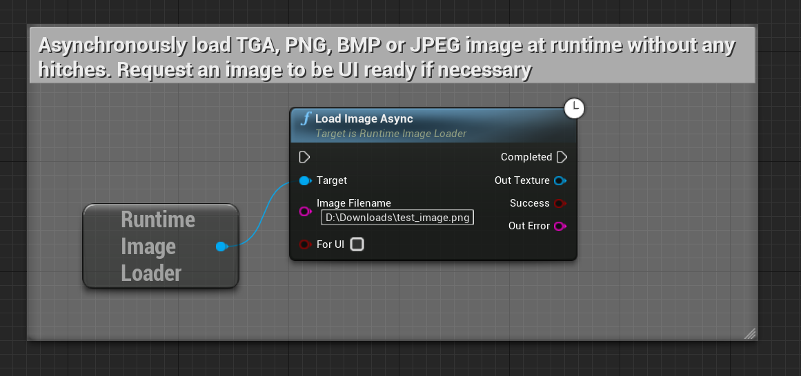

 

  

  <h3 align="center">Runtime Image Loader</h3>

  

    Load images and GIFs into Unreal at runtime without hitches!
     
     
  

[Discord](https://discord.gg/6UMSbdfdET)

This plugin can only be used in **personal non-commercial projects**. Any other questions? Please send email to business@unrealsolutions.com. 

If you are indie game developer and you are really poor (O_O) then you can DOWNLOAD just *one* copy for your game IN EXCHANGE for mentioning what your app / game is doing here:
[https://tally.so/r/n94z6V](https://tally.so/r/n94z6V)

If you represent a company then you have to buy **Professional license** [here](https://www.unrealengine.com/marketplace/en-US/product/runtime-image-loader)

## Features
- Supports loading of up to 8k resolution images in hitch-less manner
- Supports gif loading in .gif and .webp formats at runtime
- Allows to import HDR images aka Cubemaps (Windows only)
- Can load an image over HTTP or from local file storage
- Can load an image from Byte array (TArray<uint8>)
- Can transform an image during loading
- Can cancel all ongoing image loading requests (Windows only)
- Supports PNG, JPEG, BMP, TGA, OpenEXR, TIFF and QOI
- Supports 8, 16, 32 bit per channel (or up to 128 bit *pixel depth* images)
- Can generate UI ready texture format (RGBA8 or 'float' RGBA)
- Allows to set texture filtering mode
- Blueprint friendly
- No static libraries or external dependencies (except for single-header libraries)

## Testing
- Supported Unreal Engine versions: 4.27 and 5.1+
- Platforms: Windows, Linux, Mac, Android, OculusVR (experimental)
- RHIs: DirectX 11/12, Vulkan, Metal

## Blueprints

Below is the example of how to use this plugin for loading images in your blueprints/scripts:

