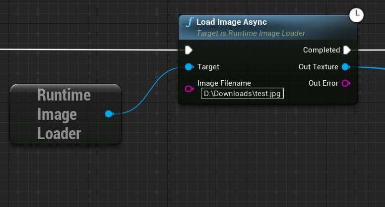

 

  

  <h3 align="center">Runtime Image Loader</h3>

  

    Load images into Unreal at runtime
     
     
  

## Features
- Fast & hitch-less & zero-freeze runtime texture loading up to 8k resolution
- Blueprint friendly (see below)
- Supports PNG, JPEG, BMP and TGA
- Supports 8, 16, 24 and 32-bit color depth 
- Output texture is in R8G8B8A8 format
- No static libraries or external dependencies
- Tested on Windows, DirectX 11 and Unreal Engine 4.27+ 
- Tested in GC-intensive environment

# Blueprints

Below is the example of how to use this plugin for loading images from your blueprints/scripts:

