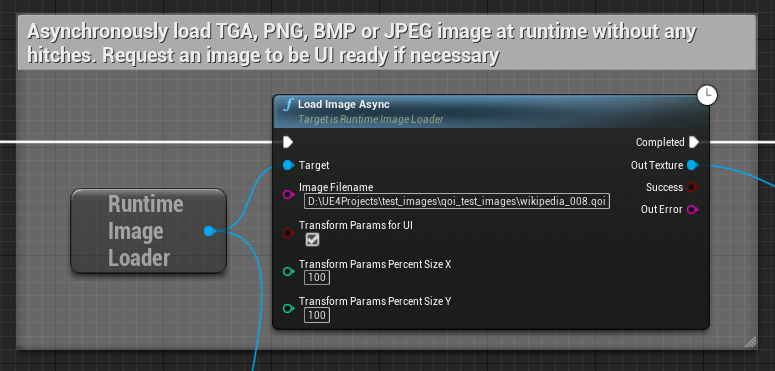

 

  

  <h3 align="center">Runtime Image Loader</h3>

  

    Load images and GIFs into Unreal at runtime without hitches!
     
     
  

**Please support developers by buying this plugin on UE Marketplace or make a donation:**
https://www.unrealengine.com/marketplace/en-US/product/runtime-image-loader 

Developer's UPDATE: This plugin has been updated to support runtime GIF Loading. Enjoy! 
Please note, there are no plans to support more advanced workflows, for example, image caching, mip generation and rare image formats. However, I always welcome pull requests adding new features.**

Discord: https://discord.gg/6UMSbdfdET

## Features
- Supports loading of up to 8k resolution images in hitch-less manner
- Supports gif loading in .gif and .webp formats at runtime
- Allows to import HDR images aka Cubemaps (Windows only)
- Can load an image over HTTP or from local file storage
- Can load an image from Byte array (TArray<uint8>)
- Can transform an image during loading
- Can cancel all ongoing image loading requests (Windows only)
- Supports PNG, JPEG, BMP, TGA, OpenEXR, TIFF and QOI
- Supports 8, 16, 32 bit per channel (or up to 128 bit *pixel depth* images)
- Can generate UI ready texture format (RGBA8 or 'float' RGBA)
- Allows to set texture filtering mode
- Blueprint friendly
- No static libraries or external dependencies (except for single-header libraries)

## Testing
- Supported Unreal Engine versions: 5.1 - 5.3!
- Platforms: Windows, Linux, Mac, Android, OculusVR (experimental)
- RHIs: DirectX 11/12, Vulkan, Metal

## Blueprints

Below is the example of how to use this plugin for loading images in your blueprints/scripts:

